# ShortSwapV1 - Advanced DeFi Trading System

[](https://www.python.org/)
[](https://flask.palletsprojects.com/)
[](LICENSE)
[](https://github.com/yourusername/shortswapv1)

## 🚀 Overview

ShortSwapV1 is a sophisticated DeFi trading system that implements an advanced **Constant Product Market Maker (CPMM)** algorithm with integrated **leveraged trading** capabilities. The system supports both spot trading and leveraged long/short positions with automated liquidation mechanisms and comprehensive risk management.

## 🏗️ System Architecture


## 🧮 Core Mathematical Algorithms

### 1. Constant Product Market Maker (CPMM)

The system implements Uniswap's proven constant product formula:

```mermaid
graph TD
    A["Constant Product Market Maker<br/>(CPMM) Algorithm"] --> B["Initial State<br/>R₀ × R₁ = k"]
    
    B --> C["Price Calculation<br/>P = R₁ / R₀"]
    
    C --> D["Buy Operation<br/>(Token1 → Token0)"]
    C --> E["Sell Operation<br/>(Token0 → Token1)"]
    
    D --> F["Amount Out Calculation<br/>Δy = (x × R₁) / (R₀ + x × fee)"]
    E --> G["Amount Out Calculation<br/>Δy = (x × R₀) / (R₁ + x × fee)"]
    
    F --> H["Reserve Update<br/>R₀' = R₀ + x × fee<br/>R₁' = R₁ - Δy"]
    G --> I["Reserve Update<br/>R₀' = R₀ - Δy<br/>R₁' = R₁ + x × fee"]
    
    H --> J["New Price<br/>P' = R₁' / R₀'"]
    I --> J
    
    J --> K["Price Impact<br/>Impact = |P' - P| / P × 100%"]
    
    style A fill:#e3f2fd
    style B fill:#f3e5f5
    style C fill:#e8f5e8
    style F fill:#fff3e0
    style G fill:#fff3e0
    style K fill:#ffebee
```



#### Mathematical Formulas:

**Price Calculation:**
```
P = R₁ / R₀
```

**Token Exchange (Buy Token0 with Token1):**
```
amount₀_out = (amount₁_in × fee × R₀) / (R₁ + amount₁_in × fee)
```

**Token Exchange (Sell Token0 for Token1):**
```
amount₁_out = (amount₀_in × fee × R₁) / (R₀ + amount₀_in × fee)
```

**Reserve Updates:**
```
R₀_new = R₀ + amount₀_in × fee
R₁_new = R₁ - amount₁_out
```

### 2. Leveraged Trading Algorithm

The system supports sophisticated leveraged trading with automated risk management:

```mermaid
graph TD
    A["Leverage Trading System"] --> B["Long Position"]
    A --> C["Short Position"]
    
    B --> D["1. Borrow USDT<br/>Amount = Base × (Leverage-1)"]
    B --> E["2. Buy Token0<br/>Total = Base + Borrowed"]
    B --> F["3. Set Forced Close Price<br/>P_force = P_current × (1 - 1/Leverage)"]
    
    C --> G["1. Borrow Token0<br/>Amount = Base × Leverage / P_current"]
    C --> H["2. Sell Token0<br/>Get USDT"]
    C --> I["3. Set Forced Close Price<br/>P_force = P_current × (1 + 1/Leverage)"]
    
    B --> J["Risk Management"]
    C --> J
    
    J --> K["Position Monitoring"]
    J --> L["Liquidation Queue"]
    J --> M["Fee Calculation"]
    
    K --> N["Price Reaches P_force"]
    N --> O["Automatic Liquidation"]
    
    O --> P["Close Position"]
    O --> Q["Repay Debt"]
    O --> R["Return Collateral"]
    
    style A fill:#e1f5fe
    style B fill:#e8f5e8
    style C fill:#ffebee
    style J fill:#fff3e0
    style O fill:#f3e5f5
```



#### Long Position Mathematics:

**Borrow Amount:**
```
borrowAmount = baseAmount × (leverage - 1)
```

**Purchase Power:**
```
totalPurchasingPower = baseAmount + borrowAmount
```

**Forced Close Price:**
```
P_liquidation = P_current × (1 - 1/leverage)
```

**Position Value:**
```
positionValue = tokenAmount × currentPrice
```

#### Short Position Mathematics:

**Borrow Amount:**
```
borrowTokenAmount = (baseAmount × leverage) / P_current
```

**Initial USDT Received:**
```
initialUSDT = borrowTokenAmount × P_current
```

**Forced Close Price:**
```
P_liquidation = P_current × (1 + 1/leverage)
```

### 3. Risk Management & Liquidation

The system employs sophisticated risk management algorithms:

**Liquidation Trigger:**
```
if (currentPrice ≤ P_liquidation_long) OR (currentPrice ≥ P_liquidation_short):
    triggerLiquidation()
```

**Profit/Loss Calculation:**
```
PnL_percentage = (currentValue - initialInvestment) / initialInvestment × 100%
```

**Fee Structure:**
- Trading Fee: 0.3% (configurable)
- Loan Fee: 1% (one-time)
- Daily Interest: 0.05% (daily)
- Liquidation Fee: 0.5% (paid to liquidator)

## 🔧 Technical Implementation

### Core Components

1. **SwapHub** (`swaphub.py`): Main trading engine with thread-safe operations
2. **ShortSwapV1Pool** (`shortswapv1pool.py`): Core pool logic implementing CPMM
3. **ShortSwapV1Order** (`shortswapv1order.py`): Sophisticated order management system
4. **Swap Utils** (`swap_utils.py`): Mathematical calculation functions
5. **ERC20Factory** (`erc20factory.py`): Token management and balance tracking

### Key Features

- **Thread-Safe Operations**: All operations are protected by locks
- **Real-time Price Monitoring**: Continuous price tracking and history
- **Automated Liquidation**: Background liquidation engine
- **Order Queue Management**: Efficient linked-list based order storage
- **Risk Calculation**: Advanced risk metrics and position monitoring

### Data Structures

#### Order Structure:
```python
order = {
    'orderID': 'unique_identifier',
    'address': 'user_address',
    'lowPrice': float,
    'hightPrice': float,
    'amount0': float,
    'amount1': float,
    'lendAmount': float,
    'timestamp': int,
    'status': 'active/closed/liquidated'
}
```

#### Pool State:
```python
pool_state = {
    'reserve0': float,      # Token0 reserves
    'reserve1': float,      # Token1 reserves (USDT)
    'loanReserve0': float,  # Available Token0 for lending
    'loanReserve1': float,  # Available USDT for lending
    'currentPrice': float,  # Current market price
    'totalVolume': float,   # Total trading volume
    'activeOrders': int     # Number of active orders
}
```

## 🚀 Getting Started

### Prerequisites

```bash
Python 3.8+
pip (Python package manager)
```

### Installation

1. **Clone the repository:**
```bash
git clone https://github.com/yourusername/shortswapv1.git
cd shortswapv1
```

2. **Install dependencies:**
```bash
pip install -r requirements.txt
```

3. **Run the application:**
```bash
cd src
python main.py
```

4. **Access the web interface:**
```
Open your browser and navigate to: http://localhost:7860
```

### Configuration

The system can be configured through the pool initialization parameters:

```python
# Pool Configuration
pool_config = {
    'fee': 0.997,                    # Trading fee (0.3%)
    'loanFee': 0.99,                 # Loan fee (1%)
    'loanDayFee': 0.9995,            # Daily interest (0.05%)
    'forcedCloseFee': 0.995,         # Liquidation fee (0.5%)
    'leverageLimit': 5,              # Maximum leverage
    'forceMoveRate': 0.10,           # Liquidation line movement
    'lendingSecondLimit': 900        # Maximum lending time (15 min)
}
```

## 📊 Performance Metrics

### Algorithm Efficiency

- **Price Calculation**: O(1) constant time
- **Order Insertion**: O(n) where n is number of orders
- **Liquidation Check**: O(1) per order
- **Memory Usage**: Linear with number of active orders

### Scalability Features

- **Concurrent Operations**: Thread-safe design supports multiple users
- **Order Optimization**: Efficient linked-list management
- **Memory Management**: Automatic cleanup of closed orders
- **Price History**: Bounded circular buffer (max 100 entries)

## 🔐 Security Features

1. **Input Validation**: All user inputs are validated
2. **Slippage Protection**: Automatic slippage calculation
3. **Liquidation Protection**: Forced close price mechanisms
4. **Integer Overflow Protection**: Safe mathematical operations
5. **Access Control**: Address-based permission system

## 📚 API Reference

### Core Trading Functions

```python
# Spot Trading
result = hub.buy(caller_address, amount1)
result = hub.sell(caller_address, amount0)

# Leveraged Trading
result = hub.short_open(caller_address, baseAmount, lendAmount, forcedClosePrice, insertOrderID)
result = hub.long_open(caller_address, baseAmount, lendAmount1, forcedClosePrice, insertOrderID)

# Fast Trading (Automated Parameter Calculation)
success, params = hub.short_fast_open(caller_address, baseAmount, levMult)
success, params = hub.long_fast_open(caller_address, baseAmount, levMult)

# Position Management
result = hub.short_close(caller_address, orderID, closeAmount0, isThirdParty)
result = hub.long_close(caller_address, orderID, closeAmount0, isThirdParty)
```

### Information Queries

```python
# Pool Information
info = hub.get_info()                           # Complete pool state
reserves = hub.get_reserves()                   # Current reserves
price = hub.get_price()                         # Current price
history = hub.get_price_history()               # Price history

# Order Information
orders = hub.get_address_history_orders(address)  # User's order history
short_orders = hub.get_short_order(num)           # Active short orders
long_orders = hub.get_long_order(num)             # Active long orders
```

## 🧪 Testing

Run the test suite:

```bash
python -m pytest tests/
```

### Test Coverage

- Unit tests for all mathematical functions
- Integration tests for trading operations
- Load testing for concurrent operations
- Edge case testing for liquidation scenarios

## 🤝 Contributing

We welcome contributions! Please follow these guidelines:

1. Fork the repository
2. Create a feature branch (`git checkout -b feature/amazing-feature`)
3. Commit your changes (`git commit -m 'Add amazing feature'`)
4. Push to the branch (`git push origin feature/amazing-feature`)
5. Open a Pull Request

### Development Standards

- Follow PEP 8 coding standards
- Add comprehensive docstrings
- Include unit tests for new features
- Update documentation for API changes

## 📄 License

This project is licensed under the MIT License - see the [LICENSE](LICENSE) file for details.

## 🙏 Acknowledgments

- Inspired by Uniswap's constant product market maker
- Built with Flask and Gradio for the web interface
- Mathematical algorithms based on DeFi best practices
- Community feedback and contributions

## 📞 Contact

- **Project Lead**: [Your Name]
- **Email**: your.email@example.com
- **GitHub**: [@yourusername](https://github.com/yourusername)
- **Documentation**: [Project Wiki](https://github.com/yourusername/shortswapv1/wiki)

---

**⚠️ Disclaimer**: This is experimental software. Use at your own risk. Not audited for production use.

**🔗 Links**: [Documentation](docs/) | [API Reference](api/) | [Examples](examples/) | [Contributing](CONTRIBUTING.md) 